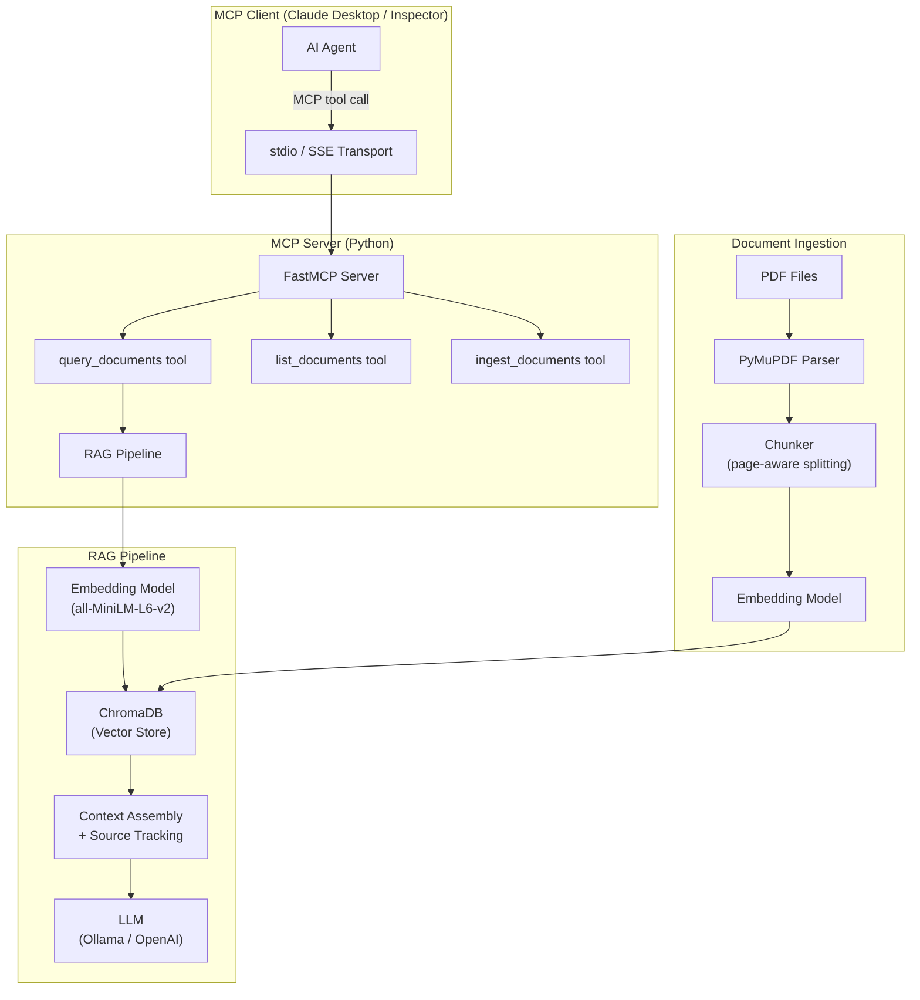

# Nexla MCP RAG Server — Implementation Plan

Build an MCP server that enables AI agents to ask natural-language questions over a set of PDF documents and receive grounded, source-attributed answers via a standard RAG (Retrieval-Augmented Generation) pipeline.

---

## 1. Technology Trade-offs & Decisions

### 1.1 MCP Framework — **FastMCP (via `mcp` SDK)**

| Option | Pros | Cons |
|---|---|---|
| **`mcp` SDK (`FastMCP`)** ✅ | Official Anthropic SDK; decorator-based API; auto-generates JSON schemas from type hints; `stdio` + SSE transports built-in; first-class MCP Inspector support | Slightly newer, less community content |
| Standalone `fastmcp` package | Higher-level wrappers | Diverges from the official SDK; may lag on spec updates |

**Decision:** Use `from mcp.server.fastmcp import FastMCP` from the **official `mcp` Python SDK**. It's the canonical implementation, and reviewers will recognize the import path as spec-compliant.

---

### 1.2 PDF Parsing — **PyMuPDF (`pymupdf` / `fitz`)**

| Option | Pros | Cons |
|---|---|---|
| **PyMuPDF** ✅ | Fastest parser (C engine); rich page metadata (page numbers, sections, fonts); Markdown output via `pymupdf4llm` | C dependency (pre-built wheels exist for all platforms) |
| pdfplumber | Excellent table extraction; pure Python | 10–50× slower; overkill if PDFs are mostly text |
| pypdf (PyPDF2) | Pure Python; lightweight | Poor extraction quality on complex layouts |

**Decision:** **PyMuPDF** — speed matters for startup ingestion of 4–5 PDFs, and the `pymupdf4llm` Markdown extraction produces LLM-friendly text with layout awareness. We don't need pdfplumber's table-mining since the primary goal is Q&A, not structured data extraction.

---

### 1.3 Embeddings — **sentence-transformers (`all-MiniLM-L6-v2`)**

| Option | Pros | Cons |
|---|---|---|
| **sentence-transformers (local)** ✅ | No API key needed; runs fully offline; zero cost; fast for small corpus | Lower quality than OpenAI text-embedding-3-small; ~384 dims |
| OpenAI `text-embedding-3-small` | Higher quality; 1536 dims | Requires API key; costs money; adds network dependency |
| Cohere Embed v3 | Strong multilingual | Requires API key |

**Decision:** **`all-MiniLM-L6-v2`** via sentence-transformers. For 4–5 PDFs (a small corpus), the quality difference vs. OpenAI embeddings is negligible, and running locally means **zero external dependencies** — the reviewer can clone the repo and run it immediately without setting up API keys for the embedding step.

> [!IMPORTANT]
> **LLM API Key Trade-off:** The embedding step is fully local, but the final answer-generation step (§1.5) will require an LLM. We offer two paths: **Ollama (fully local, no key)** or **OpenAI/Anthropic (higher quality, requires key)**. See §1.5.

---

### 1.4 Vector Store — **ChromaDB (persistent)**

| Option | Pros | Cons |
|---|---|---|
| **ChromaDB** ✅ | Built-in persistence; native metadata filtering; `pip install` simplicity; designed for RAG | Slower than FAISS at scale (irrelevant for 4–5 docs) |
| FAISS | Fastest similarity search; GPU support | No persistence; no metadata filtering; manual index management |
| Qdrant / Pinecone / Weaviate | Production-grade; cloud-native | Heavy for a local take-home; external servers |

**Decision:** **ChromaDB** with persistent storage. For 4–5 PDFs, it's the best fit: automatic persistence (survives restarts), native metadata filtering (filter by `document_name`, `page_number`), and zero infrastructure. FAISS would require us to build our own metadata layer, which adds complexity without benefit at this scale.

---

### 1.5 LLM for Answer Generation — **Configurable (Ollama default, OpenAI optional)**

| Option | Pros | Cons |
|---|---|---|
| **Ollama (local)** ✅ default | Fully offline; no API key; free | Requires Ollama install + model download; slower on CPU; needs 8GB+ RAM |
| **OpenAI GPT-4o** ✅ optional | Highest answer quality; fast | Requires `OPENAI_API_KEY` |
| Anthropic Claude | Strong reasoning | Requires API key |

**Decision:** Support **both** via a config flag. Default to **Ollama** (`llama3.2` or `mistral`) for a zero-key experience, with an `OPENAI_API_KEY` env var to optionally switch to GPT-4o. This gives the reviewer flexibility.

> [!TIP]
> The "dual-LLM" approach lets the reviewer test immediately with Ollama (no key), then optionally compare answer quality with OpenAI.

---

### 1.6 Chunking Strategy — **Recursive character splitting with page-boundary awareness**

We will chunk documents with:
- **Chunk size:** ~500 tokens (~2000 chars)
- **Overlap:** ~100 tokens (~400 chars)
- **Page-boundary tracking:** Each chunk carries metadata `{document_name, page_number, chunk_index}` so source attribution is always available
- **Section header detection:** If a heading is detected (via font-size heuristics from PyMuPDF), include it in the chunk metadata for finer attribution

---

## 2. Architecture Overview



### Separation of Concerns

| Layer | Responsibility | File |
|---|---|---|
| **MCP Interface** | Tool definitions, schema, protocol compliance | `server.py` |
| **RAG Engine** | Query embedding, retrieval, answer generation | `rag_engine.py` |
| **Document Ingestion** | PDF parsing, chunking, embedding, indexing | `ingestion.py` |
| **LLM Provider** | Abstraction over Ollama / OpenAI | `llm_provider.py` |
| **Configuration** | Environment vars, defaults, model selection | `config.py` |

---

## 3. MCP Tools Exposed

### 3.1 `query_documents` (Primary — Required)

```python
@mcp.tool()
def query_documents(question: str, top_k: int = 5) -> str:
    """
    Ask a natural language question across all ingested PDF documents.
    Returns a grounded answer with source attribution (document name, page number).
    
    Args:
        question: The natural language question to answer.
        top_k: Number of relevant chunks to retrieve (default: 5).
    
    Returns:
        A JSON string containing the answer and source references.
    """
```

**Output schema:**
```json
{
  "answer": "The detailed answer...",
  "sources": [
    {"document": "report.pdf", "page": 3, "section": "Introduction", "relevance_score": 0.87},
    {"document": "whitepaper.pdf", "page": 12, "section": "Methodology", "relevance_score": 0.82}
  ],
  "query": "original question"
}
```

### 3.2 `list_documents` (Utility)

```python
@mcp.tool()
def list_documents() -> str:
    """
    List all ingested documents with metadata (name, page count, chunk count).
    """
```

### 3.3 `ingest_documents` (Utility — Optional)

```python
@mcp.tool()
def ingest_documents(directory: str = "./documents") -> str:
    """
    Ingest or re-ingest PDF documents from the specified directory.
    Parses, chunks, embeds, and indexes all PDFs found.
    """
```

> [!NOTE]
> Documents will also be auto-ingested at server startup from a configurable `DOCUMENTS_DIR` path, so `ingest_documents` is an optional re-index trigger.

---

## 4. Project Structure

```
d:\rag\
├── documents/                    # Place the 4–5 provided PDFs here
│   ├── doc1.pdf
│   ├── doc2.pdf
│   └── ...
├── src/
│   ├── __init__.py
│   ├── server.py                 # MCP server entry point (FastMCP)
│   ├── rag_engine.py             # RAG pipeline: retrieve + generate
│   ├── ingestion.py              # PDF parsing + chunking + embedding
│   ├── llm_provider.py           # LLM abstraction (Ollama / OpenAI)
│   └── config.py                 # Configuration & environment variables
├── data/
│   └── chroma_db/                # Persistent ChromaDB storage (auto-created)
├── tests/
│   ├── test_ingestion.py
│   ├── test_rag_engine.py
│   └── test_server.py
├── examples/
│   └── interaction_log.md        # 3+ example Q&A interactions with sources
├── .env.example                  # Template for environment variables
├── requirements.txt              # Python dependencies
├── pyproject.toml                # Project metadata
├── README.md                     # Comprehensive README (see §5)
└── Nexla_Software Engineer_Assignment.pdf
```

---

## 5. README Outline

The README will include:

1. **Project Overview** — One-paragraph summary
2. **Architecture Overview** — Mermaid diagram + written explanation
3. **Setup Instructions** — Step-by-step (clone → venv → install → configure → run)
4. **Configuration** — Environment variables table (LLM choice, model name, docs directory)
5. **MCP Tool Documentation** — Each tool's inputs, outputs, example queries
6. **Example Interaction Log** — 3+ sample Q&A with source attribution
7. **Design Decisions & Trade-offs** — Why each technology was chosen
8. **Vibe Coding Section** — AI tooling experience (Antigravity/Gemini usage)
9. **Future Improvements** — What would be done with more time

---

## 6. Open Questions

> [!IMPORTANT]
> **Do you have the 4–5 PDF documents** that Nexla provided for this assignment? The assignment mentions "4–5 PDF files (data)" are provided alongside the assignment. I'll need those placed in a `documents/` directory to build and test the ingestion pipeline. Currently I only see the assignment PDF itself in `d:\rag\`.

> [!IMPORTANT]
> **LLM Preference:** Do you have a preference between:
> - **Ollama (fully local, free, no API key)** — requires installing Ollama and pulling a model (~4GB)
> - **OpenAI (cloud, requires API key)** — higher quality answers but needs `OPENAI_API_KEY`
> - **Both (recommended)** — support both with a config switch
>
> I recommend supporting both, defaulting to Ollama.

> [!NOTE]
> **API Key for embeddings:** The plan uses **local embeddings** (sentence-transformers), so no API key is needed for the retrieval step. Only the answer-generation LLM optionally needs a key.

---

## 7. Verification Plan

### Automated Tests
```bash
# Unit tests for each module
pytest tests/ -v

# Verify MCP protocol compliance with Inspector
npx -y @modelcontextprotocol/inspector python src/server.py
```

### Manual Verification
1. **MCP Inspector** — Launch the Inspector UI at `http://127.0.0.1:6274`, call `list_documents`, then `query_documents` with test questions
2. **Claude Desktop** — Add the server to `claude_desktop_config.json` and test conversational Q&A
3. **Example Interactions** — Document 3+ Q&A pairs showing multi-document awareness and source attribution

### Functional Checks
- [ ] All PDFs are parsed and indexed at startup
- [ ] `query_documents` returns answers with source attribution (doc name + page)
- [ ] Multi-document queries pull context from multiple PDFs
- [ ] Server runs via `stdio` transport (standard MCP)
- [ ] `list_documents` shows all ingested documents with metadata
- [ ] Graceful error handling for missing docs, empty queries, LLM failures

---

## 8. Implementation Order

| Phase | Tasks | Est. Time |
|---|---|---|
| **1. Foundation** | Project setup, dependencies, config module | 15 min |
| **2. Ingestion** | PDF parsing (PyMuPDF), chunking, embedding, ChromaDB indexing | 45 min |
| **3. RAG Engine** | Query embedding, retrieval, context assembly, LLM generation | 45 min |
| **4. MCP Server** | FastMCP tool definitions, server entry point, transport config | 30 min |
| **5. Testing** | Unit tests, MCP Inspector verification, example interactions | 30 min |
| **6. Documentation** | README, architecture diagram, trade-offs, vibe coding section | 30 min |
| **Total** | | **~3.25 hrs** |
